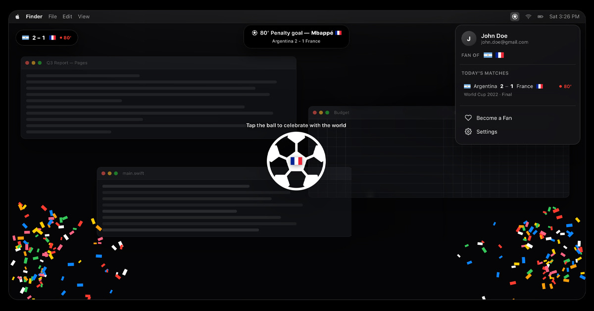

<div align="center">


# All Day I Dream About Sports

**Live football scores for Europe's top five leagues — dropped right below your MacBook notch.**

[alldayidreamaboutsports.com](https://alldayidreamaboutsports.com) &nbsp;·&nbsp;
[Download for macOS](https://alldayidreamaboutsports.com) &nbsp;·&nbsp;
[Watch the demo](https://youtu.be/XW4_LArebM8) &nbsp;·&nbsp;
[Privacy](https://alldayidreamaboutsports.com/privacy)

Free · macOS 14+ · Premier League · La Liga · Serie A · Bundesliga · Ligue 1



</div>

---

## What it is

A menu bar app for people who are supposed to be working while their team plays.

- **Notch drops.** Goals, cards, penalties, VAR checks, substitutions, kickoff
  and full-time slide in just below the notch, then get out of the way.
- **A live capsule.** Pin the running score to any corner of the screen and keep
  the match a glance away.
- **Celebrate together.** When your team scores, tap the ball — and watch the
  tap counter climb with fans around the world doing the same thing at the same
  moment.
- **Follow your teams.** Pick clubs across the top five leagues; the menu bar
  shows what's live now and what's next.

No browser tab. No phone in your hand. No notification that steals your cursor.

## What's in this repository

This is the **public source of the landing page and privacy policy** at
[alldayidreamaboutsports.com](https://alldayidreamaboutsports.com) — a static
site, no build step, served by GitHub Pages.

**The macOS app and its backend are closed source and live in a private
repository.** This README exists because the interesting part of this project
isn't the landing page — it's what sits behind it. So the architecture is
written up here in full, minus the details that would help someone abuse the
service.

- [Architecture](docs/ARCHITECTURE.md) — the long version: the polling model,
  the cost math, the safety rails, the release pipeline.
- The short version is below.

## How it's built

```
                       ┌── ticks only while a match is actually being played
                       ▼
 Football data ──▶ Cloud Run backend ──▶ object storage ──▶ CDN edge
  provider             │        ▲                            │
                       ▼        │  sign-in · celebrate        │  poll
                   Firestore    └─────── menu bar apps ◀──────┘
```

**Nothing is pushed, and nothing is per-user.** There is no APNs, no socket, no
per-user fan-out. One backend poller reads a rolling fixture window from the
data provider, diffs it against the last known state, and writes each match's
state as a small JSON object with a short cache lifetime. Every Mac in the world
polls that same cached object through the CDN.

That one decision is the whole design:

- **One goal costs one write**, whether ten people or ten million are watching.
  The reads are absorbed by the CDN edge, and tiered caching keeps the
  simultaneous cache-expiry stampede from turning into origin traffic.
- **Cost scales with matches, not users.** Five leagues are live roughly 38
  hours a week, not 168. Outside a live match window the poller enqueues no work
  at all — no provider calls, no writes, no compute. Bandwidth is the only line
  item that grows with popularity, and it's the cheapest one.
- **The only path that scales with users is the celebration counter**, and it's
  built to survive that: the app batches taps into a single call per goal, and
  the backend aggregates in memory and flushes to sharded counters on a timer,
  so database writes are proportional to server instances, never to fans.

The practical result: a million concurrent viewers is a double-digit monthly
bill, not a funding round.

### The app

SwiftUI, macOS 14+, no third-party UI. The overlay is a transparent,
click-through window layered over everything — the notch drop, the pinned score
capsule, the particle burst, the tappable ball. Match state arrives from the CDN
and runs through a diff engine into an event router, which decides what deserves
a drop and what doesn't.

Everything the app touches the outside world through is a protocol —
authentication, backend API, scores feed — so a debug build swaps in fakes and
runs a scripted demo matchday end to end without a single network call. That's
how the demo on the website was filmed, and how the animations get tuned.

### Shipping and safety

Signed with a Developer ID certificate, notarized and stapled by Apple, packaged
as a DMG in CI, and updated in place via Sparkle with EdDSA-signed appcasts —
the signing key never enters CI. Remote config carries a kill switch, a minimum
build floor for forced updates, and a feature flag for the celebration path, so
a bad release or a runaway cost can be stopped from a console in seconds, with a
fallback channel in case the config service itself is the thing that's down.

Auth is Google Sign-In, verified server-side. Every public route is
rate-limited, internal jobs are authenticated service-to-service, and the
database is deny-all to clients — nothing reaches it except through the backend.

### What the backend does *not* have

No ads. No trackers. No analytics SDK following you around. No selling of
anything to anyone. The app stores the teams you follow and the fact that you
signed in; account deletion is a single action in the app and it actually
deletes. See the [privacy policy](https://alldayidreamaboutsports.com/privacy).

## The website itself

Hand-written HTML, CSS and vanilla JavaScript — no framework, no bundler, no
dependencies, no build. The hero is a playable recreation of the app rendered in
DOM, so the landing page demonstrates the product instead of describing it.

```
index.html          landing page
privacy/index.html  privacy policy
style.css           all styles
script.js           hero demo + interactions
assets/             icons, league badges, social image
CNAME  robots.txt  sitemap.xml  site.webmanifest
```

To run it locally, serve the folder — `python3 -m http.server` — and open it.
That's the entire toolchain.

## Contributions

Thanks for the interest, but this project **isn't accepting pull requests** —
see [CONTRIBUTING.md](CONTRIBUTING.md). Bug reports and ideas are genuinely
welcome: open an issue, or email
[support@alldayidreamaboutsports.com](mailto:support@alldayidreamaboutsports.com).

## Legal

Website content and source © Nishant Hada. All rights reserved. Not affiliated
with FIFA, UEFA, the Premier League, La Liga, Serie A, the Bundesliga, Ligue 1,
or any club. Club badges and league marks belong to their respective owners.
